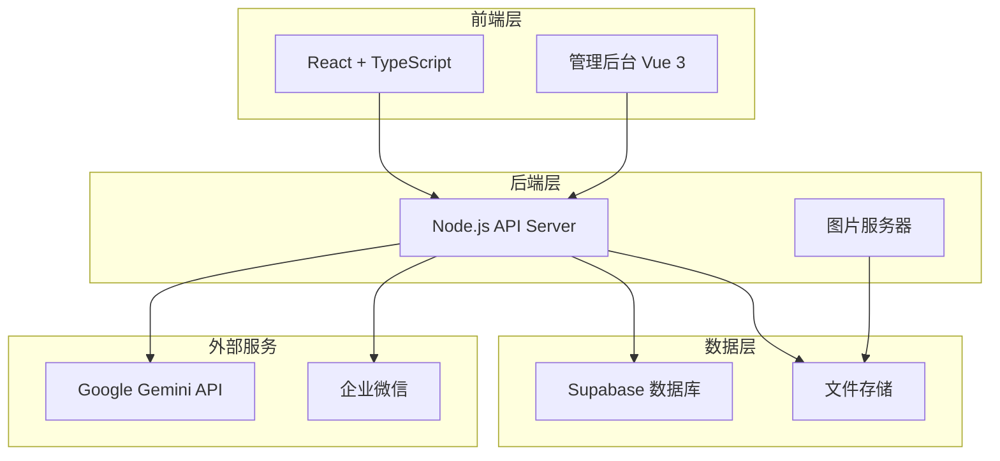

# 🍌 Nano Banana AI Image Editor

一个基于 Gemini AI 的图片生成和编辑工具，支持单用户和多用户模式。

## ✨ 主要特性

- 🎨 **AI 图片生成** - 基于 Google Gemini 2.5 Flash Image 模型
- ✏️ **图片编辑** - 支持图片修改和优化
- 👥 **双模式运行** - 支持单用户和多用户模式
- 📊 **使用统计** - 详细的 Token 使用和操作统计
- 💬 **企业微信通知** - 支持生成结果推送
- 🔐 **用户管理** - 管理员创建账户，无自助注册
- 📱 **响应式设计** - 支持桌面和移动设备
- 🐳 **Docker 部署** - 一键部署，开箱即用

## 🏗️ 系统架构



## 🚀 快速开始

### 先决条件

- Docker 和 Docker Compose
- Node.js 18+ (可选，用于本地开发)
- Supabase 实例 (多用户模式需要)

### 1. 克隆项目

```bash
git clone <repository-url>
cd NanoBananaEditor
```

### 2. 初始化配置

```bash
# 运行初始化脚本
./scripts/setup.sh

# 或手动配置
cp .env.example .env
# 编辑 .env 文件，设置必要的配置
```

### 3. 部署应用

#### 单用户模式 (推荐新用户)

```bash
./deploy.sh standalone
```

#### 多用户模式

```bash
# 确保已配置 Supabase
./deploy.sh multi-user
```

#### 生产环境 (带 Nginx)

```bash
./deploy.sh production
```

### 4. 访问应用

- **前端应用**: http://localhost:3000
- **管理后台**: http://localhost:3003 (多用户模式)
- **API 接口**: http://localhost:3002

## 🔧 配置说明

### 环境变量配置

创建 `.env` 文件并配置以下变量：

```bash
# === 应用模式配置 ===
VITE_APP_MODE=standalone  # 或 multi-user

# === API 配置 ===
VITE_GEMINI_API_KEY=your_gemini_api_key

# === 多用户模式配置 (仅多用户模式需要) ===
VITE_SUPABASE_URL=https://your-project.supabase.co
VITE_SUPABASE_ANON_KEY=your_anon_key
SUPABASE_SERVICE_ROLE_KEY=your_service_role_key

# === 服务端口配置 ===
FRONTEND_PORT=3000
IMAGE_SERVER_PORT=3002
ADMIN_PORT=3003

# === 企业微信通知 (可选) ===
VITE_WECOM_WEBHOOK_URL=https://qyapi.weixin.qq.com/cgi-bin/webhook/send?key=xxx
```

### 数据库配置 (多用户模式)

1. 在 Supabase 中运行迁移文件：

```sql
-- 执行 supabase/migrations/001_initial_setup.sql 中的内容
```

2. 配置 Row Level Security (RLS) 策略

## 📖 使用指南

### 单用户模式

1. 启动应用后直接访问前端页面
2. 输入提示词生成图片
3. 支持图片编辑和下载
4. 所有操作无需登录

### 多用户模式

1. 管理员通过管理后台创建用户账户
2. 用户使用邮箱和密码登录
3. 系统记录每个用户的使用统计
4. 管理员可查看所有用户的使用情况

### 管理后台功能

- 📊 **概览页面** - 系统整体使用统计
- 👥 **用户管理** - 创建、编辑、删除用户
- 📈 **使用统计** - 详细的使用数据分析
- 📋 **操作日志** - 用户操作记录查询
- ⚙️ **系统设置** - 系统配置和维护

## 🛠️ 开发指南

### 本地开发

```bash
# 安装依赖
npm install

# 启动前端开发服务器
npm run dev

# 启动后端服务器 (另一个终端)
cd server
node imageServerExtended.cjs

# 启动管理后台 (另一个终端)
cd admin
npm run dev
```

### 项目结构

```
.
├── src/                    # 前端源代码
├── server/                 # 后端服务器
├── admin/                  # 管理后台
├── supabase/              # 数据库迁移
├── scripts/               # 部署脚本
├── docker-compose.yml     # Docker 编排
├── deploy.sh             # 部署脚本
└── README.md            # 项目文档
```

## 🔄 部署命令参考

```bash
# 基础部署
./deploy.sh standalone          # 单用户模式
./deploy.sh multi-user         # 多用户模式
./deploy.sh production         # 生产环境

# 高级选项
./deploy.sh --help             # 查看帮助
./deploy.sh --force            # 强制重建
./deploy.sh --no-cache         # 无缓存构建
./deploy.sh --pull             # 拉取最新镜像
./deploy.sh --logs             # 显示部署日志
```

## 📦 备份与恢复

### 数据备份

```bash
# 完整备份
./scripts/backup.sh --full

# 仅备份数据库
./scripts/backup.sh --database

# 仅备份图片文件
./scripts/backup.sh --images

# 压缩备份
./scripts/backup.sh --full --compress
```

### 数据恢复

备份文件保存在 `./backups` 目录中，包含：
- 配置文件
- 用户生成的图片
- 数据库导出
- 系统日志

## 🚨 故障排除

### 常见问题

1. **Gemini API 调用失败**
   - 检查 API Key 是否正确
   - 确认网络连接正常
   - 查看 API 使用配额

2. **多用户模式无法使用**
   - 检查 Supabase 配置是否正确
   - 确认数据库迁移已执行
   - 验证 RLS 策略是否启用

3. **图片无法保存**
   - 检查 `generated_images` 目录权限
   - 确认磁盘空间足够
   - 查看服务器日志

4. **企业微信通知失败**
   - 验证 Webhook URL 是否正确
   - 检查网络连接
   - 确认机器人权限

### 日志查看

```bash
# 查看所有服务日志
docker-compose logs -f

# 查看特定服务日志
docker-compose logs -f frontend
docker-compose logs -f backend
docker-compose logs -f admin
```

## 🤝 贡献指南

欢迎提交 Issue 和 Pull Request！

## 📄 许可证

本项目采用 MIT 许可证。

## 🙏 致谢

- Google Gemini API
- Supabase
- React 和 Vue.js 社区
- Docker 和容器化技术

---

**🍌 Nano Banana AI Image Editor - 让 AI 图片生成变得简单有趣！**
