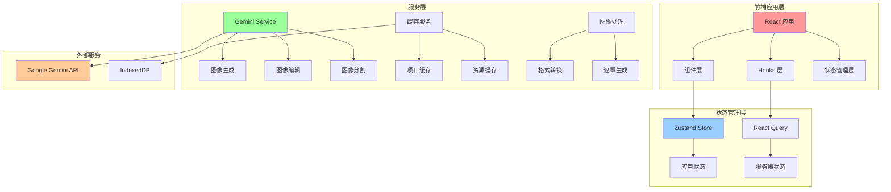
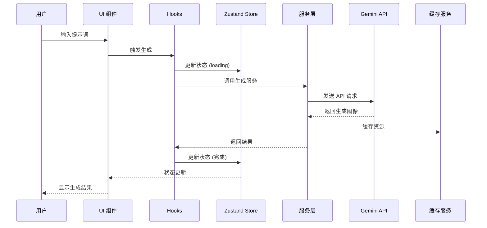

# 🍌 Nano Banana AI Image Editor - 架构文档

## 项目概述

Nano Banana AI Image Editor 是一个基于现代 Web 技术构建的 AI 图像生成和编辑平台。该项目采用 React + TypeScript 前端架构，整合了 Google Gemini 2.5 Flash Image 模型，提供专业级的图像生成、对话式编辑和区域感知修改功能。

### 核心特性
- **AI 驱动的图像生成**：基于文本提示生成高质量图像
- **智能图像编辑**：使用自然语言指令进行图像修改
- **区域感知编辑**：通过绘制遮罩精确指定编辑区域
- **交互式画布**：支持缩放、平移的图像展示界面
- **项目管理**：完整的生成历史和版本控制
- **离线缓存**：基于 IndexedDB 的本地资源存储

## 技术栈

### 前端技术栈

| 技术 | 版本 | 用途 |
|------|------|------|
| **React** | 18.3.1 | 用户界面框架 |
| **TypeScript** | 5.5.3 | 类型安全的 JavaScript 超集 |
| **Vite** | 5.4.2 | 快速构建工具和开发服务器 |
| **Tailwind CSS** | 3.4.1 | 原子化 CSS 框架 |
| **Zustand** | 5.0.8 | 轻量级状态管理库 |
| **React Query** | 5.85.5 | 服务器状态管理 |
| **Konva.js** | 9.3.22 | 2D 画布库用于图像交互 |
| **React Konva** | 18.2.10 | Konva 的 React 封装 |

### AI 和服务集成

| 技术 | 版本 | 用途 |
|------|------|------|
| **Google GenAI** | 1.16.0 | Gemini 2.5 Flash Image 模型接口 |
| **idb-keyval** | 6.2.2 | IndexedDB 存储抽象层 |

### 开发工具

| 工具 | 版本 | 用途 |
|------|------|------|
| **ESLint** | 9.9.1 | 代码质量检查 |
| **TypeScript ESLint** | 8.3.0 | TypeScript 特定的 ESLint 规则 |
| **PostCSS** | 8.4.35 | CSS 处理工具 |
| **Autoprefixer** | 10.4.18 | CSS 浏览器兼容性前缀 |

## 系统架构

### 整体架构图



### 数据流架构



## 核心模块设计

### 1. 组件层架构

#### 主要组件结构

```
src/components/
├── ui/                     # 基础 UI 组件
│   ├── Button.tsx         # 按钮组件
│   ├── Input.tsx          # 输入框组件
│   └── Textarea.tsx       # 文本域组件
├── Header.tsx             # 应用头部导航
├── PromptComposer.tsx     # 提示词编辑器
├── ImageCanvas.tsx        # 交互式画布
├── MaskOverlay.tsx        # 遮罩绘制组件
├── HistoryPanel.tsx       # 历史记录面板
├── ImagePreviewModal.tsx  # 图像预览模态框
├── InfoModal.tsx          # 信息展示模态框
└── PromptHints.tsx        # 提示词建议组件
```

#### 组件职责分离

1. **Header 组件** (`src/components/Header.tsx`)
   - 工具栏切换 (生成/编辑/选择)
   - 面板显示控制
   - 应用信息入口

2. **PromptComposer 组件** (`src/components/PromptComposer.tsx`)
   - 提示词输入和编辑
   - 参数配置 (温度、种子)
   - 参考图像管理
   - 生成/编辑操作触发

3. **ImageCanvas 组件** (`src/components/ImageCanvas.tsx`)
   - 基于 Konva.js 的图像显示
   - 缩放、平移交互
   - 遮罩绘制集成

4. **HistoryPanel 组件** (`src/components/HistoryPanel.tsx`)
   - 生成历史展示
   - 版本对比
   - 项目管理

### 2. 状态管理架构

#### Zustand Store 设计

```typescript
interface AppState {
  // 项目状态
  currentProject: Project | null;
  
  // 画布状态
  canvasImage: string | null;
  canvasZoom: number;
  canvasPan: { x: number; y: number };
  
  // 图像资源
  uploadedImages: string[];
  editReferenceImages: string[];
  
  // 绘制状态
  brushStrokes: BrushStroke[];
  brushSize: number;
  showMasks: boolean;
  
  // 生成参数
  isGenerating: boolean;
  currentPrompt: string;
  temperature: number;
  seed: number | null;
  
  // UI 状态
  selectedTool: 'generate' | 'edit' | 'mask';
  showPromptPanel: boolean;
  showHistory: boolean;
}
```

#### 状态管理特点

- **集中式状态管理**：使用 Zustand 进行全局状态管理
- **类型安全**：完整的 TypeScript 类型定义
- **性能优化**：细粒度的状态更新，避免不必要的重渲染
- **持久化**：关键状态的本地存储

### 3. 服务层架构

#### Gemini 服务 (`src/services/geminiService.ts`)

```typescript
export class GeminiService {
  // 图像生成
  async generateImage(request: GenerationRequest): Promise<string[]>
  
  // 图像编辑
  async editImage(request: EditRequest): Promise<string[]>
  
  // 图像分割 (未来功能)
  async segmentImage(request: SegmentationRequest): Promise<any>
}
```

**服务特点：**
- **统一的 API 接口**：封装 Gemini API 调用
- **错误处理**：完善的异常捕获和用户友好的错误信息
- **参数验证**：请求参数的类型检查和验证
- **响应处理**：Base64 图像数据的提取和转换

#### 缓存服务 (`src/services/cacheService.ts`)

```typescript
export class CacheService {
  // 项目缓存
  static async saveProject(project: Project): Promise<void>
  static async getProject(id: string): Promise<Project | null>
  
  // 资源缓存
  static async cacheAsset(asset: Asset, data: Blob): Promise<void>
  static async getCachedAsset(assetId: string): Promise<{asset: Asset; data: Blob} | null>
  
  // 清理机制
  static async clearOldCache(maxAge: number): Promise<void>
}
```

**缓存策略：**
- **分层缓存**：项目元数据与资源数据分离存储
- **版本控制**：缓存键包含版本信息，支持迁移
- **过期清理**：自动清理过期的缓存项
- **离线支持**：支持离线访问已缓存的资源

### 4. 数据模型设计

#### 核心数据类型

```typescript
// 资源模型
interface Asset {
  id: string;
  type: 'original' | 'mask' | 'output';
  url: string;
  mime: string;
  width: number;
  height: number;
  checksum: string;
}

// 生成记录模型
interface Generation {
  id: string;
  prompt: string;
  parameters: {
    seed?: number;
    temperature?: number;
  };
  sourceAssets: Asset[];
  outputAssets: Asset[];
  modelVersion: string;
  timestamp: number;
}

// 编辑记录模型
interface Edit {
  id: string;
  parentGenerationId: string;
  maskAssetId?: string;
  instruction: string;
  outputAssets: Asset[];
  timestamp: number;
}

// 项目模型
interface Project {
  id: string;
  title: string;
  generations: Generation[];
  edits: Edit[];
  createdAt: number;
  updatedAt: number;
}
```

## 性能优化策略

### 1. 渲染优化
- **React.memo**：防止不必要的组件重渲染
- **useMemo/useCallback**：缓存计算结果和函数引用
- **虚拟化**：历史列表的虚拟滚动 (待实现)

### 2. 网络优化
- **React Query**：请求缓存和重复请求去重
- **图像压缩**：上传前的图像预处理
- **分片上传**：大文件的分片传输 (待实现)

### 3. 存储优化
- **IndexedDB**：本地资源缓存减少重复下载
- **压缩存储**：图像和数据的压缩存储
- **懒加载**：按需加载历史记录

### 4. 内存管理
- **资源清理**：Canvas 和 Blob 对象的及时清理
- **弱引用**：对大对象使用弱引用
- **分页加载**：历史数据的分页获取

## 安全架构

### 1. 数据安全
- **客户端加密**：敏感数据的本地加密存储
- **API 密钥保护**：生产环境使用后端代理
- **数据校验**：输入数据的严格验证

### 2. 隐私保护
- **本地处理**：图像处理尽量在本地完成
- **数据最小化**：只传输必要的数据
- **用户控制**：用户可控制的数据保留策略

### 3. 内容安全
- **SynthID 水印**：AI 生成内容的可验证性
- **内容过滤**：不当内容的检测和过滤
- **使用监控**：API 使用的监控和限制

## 扩展性设计

### 1. 插件架构 (规划中)
- **过滤器系统**：可扩展的图像处理过滤器
- **工具集成**：第三方工具的集成接口
- **模型适配器**：支持多种 AI 模型的适配层

### 2. 多租户支持 (规划中)
- **用户管理**：用户认证和授权系统
- **项目隔离**：多用户环境下的数据隔离
- **资源配额**：用户级别的资源使用限制

### 3. API 扩展
- **RESTful API**：标准化的后端 API 接口
- **WebSocket**：实时状态更新
- **Webhook**：事件驱动的集成

## 部署架构

### 1. 开发环境
```bash
npm run dev      # 启动开发服务器
npm run build    # 构建生产版本
npm run preview  # 预览生产构建
npm run lint     # 代码质量检查
```

### 2. 生产环境建议
- **CDN 部署**：静态资源的全球分发
- **负载均衡**：高可用性的服务器集群
- **监控告警**：应用性能和错误监控
- **自动扩缩**：基于负载的自动扩展

### 3. 容器化部署
```dockerfile
# Dockerfile 示例
FROM node:18-alpine
WORKDIR /app
COPY package*.json ./
RUN npm ci --only=production
COPY dist ./dist
EXPOSE 5173
CMD ["npm", "run", "preview"]
```

## 测试策略

### 1. 单元测试
- **组件测试**：React 组件的独立测试
- **服务测试**：业务逻辑的单元测试
- **工具函数测试**：纯函数的测试覆盖

### 2. 集成测试
- **API 集成**：与 Gemini API 的集成测试
- **存储集成**：缓存服务的集成测试
- **端到端测试**：用户流程的完整测试

### 3. 性能测试
- **渲染性能**：组件渲染时间测试
- **内存泄漏**：长时间运行的内存监控
- **网络性能**：API 响应时间测试

## 未来发展规划

### 短期目标 (1-3 个月)
- [ ] 后端 API 代理实现
- [ ] 用户认证和项目分享功能
- [ ] 高级画笔工具和选择方法
- [ ] 移动端适配优化

### 中期目标 (3-6 个月)
- [ ] 插件系统框架
- [ ] 云存储集成
- [ ] 协作编辑功能
- [ ] AI 模型切换支持

### 长期目标 (6+ 个月)
- [ ] 桌面应用版本
- [ ] 高级图像分析工具
- [ ] 机器学习管道集成
- [ ] 企业级功能完善

---

**文档维护**：本文档应随着项目发展持续更新，确保架构设计与实际实现保持一致。