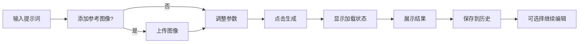
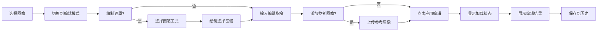

# 🍌 Nano Banana AI Image Editor - 设计文档

## 设计理念

Nano Banana AI Image Editor 的设计遵循"**简洁而强大**"的核心理念，旨在为用户提供直观、高效的 AI 图像创作体验。我们的设计原则建立在以下基础之上：

### 核心设计原则

1. **用户至上**：以用户体验为中心，简化复杂操作
2. **渐进式披露**：根据用户熟练度逐步展示功能
3. **即时反馈**：提供实时的操作反馈和状态提示
4. **跨平台一致性**：确保在不同设备上的一致体验
5. **可访问性优先**：支持键盘导航和屏幕阅读器

## 用户界面设计

### 整体布局架构

```
┌─────────────────────────────────────────────────────────┐
│                    Header 工具栏                        │
├─────────────┬─────────────────────────┬─────────────────┤
│             │                         │                 │
│   Prompt    │                         │    History      │
│  Composer   │      Image Canvas       │     Panel       │
│   面板       │         画布            │     历史        │
│  (可折叠)    │                         │   (可折叠)       │
│             │                         │                 │
└─────────────┴─────────────────────────┴─────────────────┘
```

### 响应式设计策略

#### 桌面端布局 (>= 1024px)
- **三栏布局**：Prompt Composer + Canvas + History Panel
- **工具栏固定**：顶部工具栏始终可见
- **面板可折叠**：支持专注模式的全屏画布

#### 平板端布局 (768px - 1023px)
- **双栏布局**：Canvas + 可切换侧面板
- **浮动面板**：History 和 Prompt 面板采用浮动设计
- **手势支持**：支持滑动切换面板

#### 移动端布局 (< 768px)
- **单栏布局**：全屏画布为主
- **底部操作栏**：主要操作移至底部
- **模态面板**：所有面板采用模态窗口形式

### 视觉设计规范

#### 色彩系统

**主色调 - 深色主题**
```css
/* 背景色系 */
--bg-primary: #111827     /* 深灰主背景 */
--bg-secondary: #1f2937   /* 次级背景 */
--bg-tertiary: #374151    /* 三级背景 */

/* 文本色系 */
--text-primary: #f9fafb   /* 主要文本 */
--text-secondary: #d1d5db /* 次要文本 */
--text-muted: #9ca3af     /* 辅助文本 */

/* 品牌色系 */
--brand-primary: #a855f7  /* 紫色主色 */
--brand-secondary: #ec4899 /* 粉色辅助色 */
--brand-accent: #06b6d4   /* 青色强调色 */

/* 状态色系 */
--success: #10b981        /* 成功绿 */
--warning: #f59e0b        /* 警告橙 */
--error: #ef4444          /* 错误红 */
--info: #3b82f6           /* 信息蓝 */
```

**辅助色调 - 浅色主题 (可选)**
```css
/* 背景色系 */
--bg-primary: #ffffff
--bg-secondary: #f9fafb
--bg-tertiary: #f3f4f6

/* 文本色系 */
--text-primary: #111827
--text-secondary: #374151
--text-muted: #6b7280
```

#### 字体系统

```css
/* 字体族 */
--font-sans: 'Inter', -apple-system, BlinkMacSystemFont, sans-serif;
--font-mono: 'JetBrains Mono', 'Fira Code', monospace;

/* 字体大小 */
--text-xs: 0.75rem      /* 12px */
--text-sm: 0.875rem     /* 14px */
--text-base: 1rem       /* 16px */
--text-lg: 1.125rem     /* 18px */
--text-xl: 1.25rem      /* 20px */
--text-2xl: 1.5rem      /* 24px */
--text-3xl: 1.875rem    /* 30px */

/* 行高 */
--leading-tight: 1.25
--leading-normal: 1.5
--leading-relaxed: 1.75
```

#### 间距系统

```css
/* 间距单位 (基于 8px 网格) */
--space-1: 0.25rem      /* 4px */
--space-2: 0.5rem       /* 8px */
--space-3: 0.75rem      /* 12px */
--space-4: 1rem         /* 16px */
--space-6: 1.5rem       /* 24px */
--space-8: 2rem         /* 32px */
--space-12: 3rem        /* 48px */
--space-16: 4rem        /* 64px */
--space-20: 5rem        /* 80px */
```

#### 圆角系统

```css
/* 圆角半径 */
--radius-sm: 0.125rem   /* 2px */
--radius-md: 0.375rem   /* 6px */
--radius-lg: 0.5rem     /* 8px */
--radius-xl: 0.75rem    /* 12px */
--radius-2xl: 1rem      /* 16px */
--radius-full: 9999px   /* 圆形 */
```

## 组件设计系统

### 基础组件库

#### 1. Button 组件

**设计规范：**
- **大小变体**：sm, md, lg
- **样式变体**：primary, secondary, outline, ghost
- **状态**：default, hover, active, disabled, loading

```typescript
interface ButtonProps {
  variant?: 'primary' | 'secondary' | 'outline' | 'ghost';
  size?: 'sm' | 'md' | 'lg';
  disabled?: boolean;
  loading?: boolean;
  icon?: ReactNode;
  children: ReactNode;
}
```

#### 2. Input 组件

**设计规范：**
- **类型支持**：text, password, email, number, search
- **状态反馈**：error, success, warning
- **辅助元素**：label, helper text, icon

```typescript
interface InputProps {
  type?: string;
  placeholder?: string;
  value?: string;
  error?: string;
  helperText?: string;
  icon?: ReactNode;
  disabled?: boolean;
}
```

#### 3. Modal 组件

**设计规范：**
- **尺寸变体**：sm, md, lg, xl, fullscreen
- **动画效果**：fade + scale 过渡
- **无障碍**：焦点管理和键盘导航

### 业务组件设计

#### 1. PromptComposer 组件

**功能设计：**
```typescript
interface PromptComposerProps {
  mode: 'generate' | 'edit';
  onSubmit: (params: GenerationParams) => void;
  isLoading?: boolean;
}

interface GenerationParams {
  prompt: string;
  temperature: number;
  seed?: number;
  referenceImages: string[];
}
```

**交互设计：**
- **智能提示**：基于上下文的提示词建议
- **参数控制**：直观的滑块和数值输入
- **图像管理**：拖拽上传和预览缩略图
- **快捷操作**：Cmd/Ctrl + Enter 提交

**视觉设计：**
- 可折叠面板设计，节省空间
- 清晰的分组和层次结构
- 实时字符计数和参数预览

#### 2. ImageCanvas 组件

**功能设计：**
```typescript
interface ImageCanvasProps {
  image?: string;
  masks?: MaskData[];
  zoom: number;
  pan: { x: number; y: number };
  tool: 'view' | 'brush' | 'eraser';
  onZoomChange: (zoom: number) => void;
  onPanChange: (pan: { x: number; y: number }) => void;
  onMaskUpdate: (masks: MaskData[]) => void;
}
```

**交互设计：**
- **多点触控**：支持手势缩放和平移
- **精确绘制**：压感和平滑曲线支持
- **快捷键**：空格键临时切换到拖拽模式
- **网格对齐**：可选的像素网格辅助

**性能优化：**
- Canvas 虚拟化，支持大图像处理
- 分层渲染，减少重绘开销
- 智能缓存，优化内存使用

#### 3. HistoryPanel 组件

**功能设计：**
```typescript
interface HistoryPanelProps {
  project: Project;
  selectedGeneration?: string;
  selectedEdit?: string;
  onSelect: (type: 'generation' | 'edit', id: string) => void;
  onCompare: (ids: string[]) => void;
}
```

**信息架构：**
```
Project
├── Generation 1 (提示词A)
│   ├── Output 1a
│   ├── Output 1b
│   └── Edits
│       ├── Edit 1.1 (修改指令)
│       └── Edit 1.2 (修改指令)
├── Generation 2 (提示词B)
│   └── Output 2a
└── Generation 3 (基于 Edit 1.1)
    └── Output 3a
```

**交互设计：**
- **树形结构**：清晰的父子关系展示
- **缩略图预览**：快速识别不同版本
- **对比模式**：并排对比多个版本
- **批量操作**：多选删除和导出

## 交互设计规范

### 操作流程设计

#### 1. 图像生成流程



#### 2. 图像编辑流程



### 状态反馈设计

#### 1. 加载状态

**视觉反馈：**
- **进度指示器**：线性进度条显示生成进度
- **状态文本**：描述当前处理阶段
- **预估时间**：基于历史数据的时间预估
- **取消按钮**：允许用户中断长时间操作

**动画设计：**
```css
/* 脉冲动画用于加载状态 */
@keyframes pulse {
  0%, 100% { opacity: 1; }
  50% { opacity: 0.5; }
}

.loading {
  animation: pulse 2s ease-in-out infinite;
}
```

#### 2. 错误状态

**错误分类：**
- **网络错误**：连接失败、超时等
- **API 错误**：配额超限、请求格式错误等
- **内容错误**：不当内容检测、格式不支持等
- **系统错误**：内存不足、浏览器兼容性等

**错误处理策略：**
```typescript
interface ErrorState {
  type: 'network' | 'api' | 'content' | 'system';
  message: string;
  action?: {
    label: string;
    handler: () => void;
  };
  dismissible: boolean;
}
```

#### 3. 成功状态

**成功反馈：**
- **Toast 通知**：操作成功的简短提示
- **视觉高亮**：新生成内容的高亮显示
- **声音反馈**：可选的成功提示音

### 无障碍设计

#### 1. 键盘导航

**快捷键系统：**
```typescript
const shortcuts = {
  'Cmd/Ctrl + Enter': '生成/应用编辑',
  'Shift + R': '重新生成变体',
  'E': '切换到编辑模式',
  'G': '切换到生成模式',
  'M': '切换到遮罩模式',
  'H': '切换历史面板',
  'P': '切换提示词面板',
  'Escape': '取消当前操作',
  'Space': '临时拖拽工具',
  '+/-': '画布缩放',
  '方向键': '画布平移'
};
```

#### 2. 屏幕阅读器支持

**语义化标记：**
```html
<!-- 主要区域标记 -->
<main role="main" aria-label="图像编辑器">
  <section role="region" aria-label="提示词编辑器">
    <h2>提示词</h2>
    <textarea aria-describedby="prompt-help">...</textarea>
    <div id="prompt-help">输入描述您想要创建的图像</div>
  </section>
  
  <section role="region" aria-label="图像画布">
    <h2>预览画布</h2>
    <canvas aria-label="生成的图像预览">...</canvas>
  </section>
</main>
```

**状态通知：**
```typescript
// 使用 aria-live 区域通知状态变化
const announceStatus = (message: string, priority: 'polite' | 'assertive' = 'polite') => {
  const announcement = document.createElement('div');
  announcement.setAttribute('aria-live', priority);
  announcement.textContent = message;
  // 添加到 DOM，然后移除
};
```

## 性能设计考虑

### 1. 渲染性能

**React 优化策略：**
- **组件懒加载**：使用 React.lazy 和 Suspense
- **状态分离**：避免不必要的全局状态更新
- **虚拟化**：长列表的虚拟滚动实现
- **防抖节流**：输入事件的防抖处理

```typescript
// 防抖 hook 示例
const useDebouncedCallback = (callback: Function, delay: number) => {
  const timeoutRef = useRef<NodeJS.Timeout>();
  
  return useCallback((...args: any[]) => {
    if (timeoutRef.current) {
      clearTimeout(timeoutRef.current);
    }
    timeoutRef.current = setTimeout(() => callback(...args), delay);
  }, [callback, delay]);
};
```

### 2. 内存管理

**资源清理策略：**
- **Canvas 清理**：及时销毁未使用的 Canvas 元素
- **图像缓存**：LRU 缓存策略管理图像资源
- **WeakMap 引用**：对大对象使用弱引用

```typescript
// 图像缓存管理
class ImageCache {
  private cache = new Map<string, { image: HTMLImageElement; timestamp: number }>();
  private maxSize = 50;
  
  set(key: string, image: HTMLImageElement) {
    // 实现 LRU 逻辑
    if (this.cache.size >= this.maxSize) {
      const oldestKey = this.getOldestKey();
      this.cache.delete(oldestKey);
    }
    this.cache.set(key, { image, timestamp: Date.now() });
  }
  
  get(key: string): HTMLImageElement | null {
    const item = this.cache.get(key);
    if (item) {
      item.timestamp = Date.now();
      return item.image;
    }
    return null;
  }
}
```

### 3. 网络优化

**请求优化：**
- **请求合并**：多个小请求合并为批量请求
- **缓存策略**：合理的 HTTP 缓存设置
- **压缩传输**：图像和数据的压缩传输
- **重试机制**：网络错误的智能重试

## 品牌与视觉识别

### 1. Logo 和图标设计

**Logo 设计原则：**
- **香蕉元素**：体现"Nano Banana"的品牌特色
- **AI 科技感**：融入现代科技元素
- **简洁识别**：在不同尺寸下的清晰识别

**图标风格：**
- **线性图标**：2px 描边，圆形端点
- **统一风格**：Lucide React 图标库为基础
- **语义清晰**：直观的图标语言

### 2. 动画和过渡

**动画原则：**
- **有意义的动画**：每个动画都有明确目的
- **性能优先**：使用 transform 和 opacity 属性
- **可控制性**：支持用户关闭动画

**过渡时间：**
```css
/* 标准过渡时间 */
--duration-fast: 150ms
--duration-normal: 250ms
--duration-slow: 350ms

/* 缓动函数 */
--ease-in: cubic-bezier(0.4, 0, 1, 1)
--ease-out: cubic-bezier(0, 0, 0.2, 1)
--ease-in-out: cubic-bezier(0.4, 0, 0.2, 1)
```

## 设计系统维护

### 1. 组件文档

**Storybook 集成：**
- **组件展示**：所有组件的视觉展示
- **交互测试**：组件的交互行为测试
- **API 文档**：Props 和事件的完整文档

### 2. 设计 Token

**设计系统代码：**
```typescript
// design-tokens.ts
export const tokens = {
  colors: {
    primary: '#a855f7',
    secondary: '#ec4899',
    // ... 其他颜色
  },
  spacing: {
    xs: '0.25rem',
    sm: '0.5rem',
    // ... 其他间距
  },
  typography: {
    fontFamily: {
      sans: ['Inter', 'sans-serif'],
      mono: ['JetBrains Mono', 'monospace'],
    },
    // ... 其他字体设置
  }
};
```

### 3. 版本控制

**设计版本管理：**
- **语义化版本**：遵循 semver 规范
- **变更日志**：详细的设计变更记录
- **向后兼容**：保证旧版本的兼容性

---

**设计系统演进**：这个设计系统将随着产品发展不断演进，我们承诺保持设计的一致性和用户体验的连贯性。